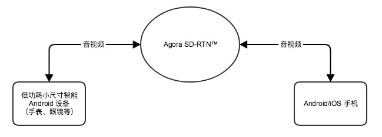

# 智能设备低功耗：从方案到集成

Other Language: [English](README.md)

Agora 为智能设备提供低功耗解决方案，包含:

* 场景描述
* 实现方案
* 推荐配置
* 集成方法

## 场景描述

* 成熟的互联网低功耗实时音视频解决方案
* 适用于低功耗、小尺寸智能设备


## 实现方案

声网借助 Agora SDK，针对功耗进行端到端的优化，实现低功耗小尺寸智能穿戴设备上的音视频通话。
下图为低功耗音视频解决方案的实现架构图：




要获取声网低功耗 SDK，请联系 sales@agora.io，电话 4006326626。

**注意:** 智能设备侧做了功耗优化后，针对硬件特性定制优化了一些功能模块，考虑到对不同型号手机的兼容性，手机上需要使用标准公版2.2.0 SDK。

## 推荐配置

声网建议智能可穿戴设备满足以下硬件配置：

* CPU 不低于800 MHz
* RAM memory 不低于512 M


## 集成方法

本节以声网提供的 [示例项目](https://github.com/AgoraIO/ARD-Agora-RTC-Low-Power/tree/master/Android/LowPowerWatch) 为例，演示智能手表如何快速集成 Agora 视频 SDK，实现多人视频连麦直播。

这个示例项目包含以下功能：

* 加入通话和离开通话
* 静音和解除静音


### 集成 SDK

#### 步骤 1: 准备环境

1. 下载声网提供的低功耗音视频通话 SDK
2. 确保满足以下开发环境要求:

    * Android Studio 2.0 或以上版本

    * 支持语音和视频功能的真实 Android 设备

3. 请确保在使用 Agora 相关功能及服务前，已打开特定端口，详见 [防火墙说明](https://docs.agora.io/cn/2.4/product/Interactive%20Broadcast/Agora%20Platform/firewall?platform=All%20Platforms) 。


#### 步骤 2: 添加 SDK


1. 解压下载的 SDK ， 将其中的 *libs* 文件夹下的 *agora-rtc-sdk.jar* 复制到示例项目的 *app/libs* 下， 将 *libs* 文件夹下的 *arm64-v8a* ， *x86* ， *armeabi-v7a* 文件夹复制到示例项目的 *app/src/main/jniLibs* 下。

2. 确保示例项目的 *app/build.gradle* 文件 dependencies 属性中添加如下依赖关系::

   ```
    compile fileTree(dir: 'libs', include: ['*.jar'])
   ```

#### 步骤 3: 同步项目文件

点击 **Sync Project With Gradle Files** ，直到同步完成。


**注意:** SDK 下载链接请联系 sales@agora.io 获取。

### 加入声网频道实现音视频通话

1. 申请 App ID，详见 [获取 App ID](https://docs.agora.io/cn/2.4/product/Interactive%20Broadcast/Agora%20Platform/token?platform=All%20Platforms)。

2. 创建 RtcEngine 对象，并填入 App ID，详见 [create()](https://docs.agora.io/cn/2.4/product/Interactive%20Broadcast/API%20Reference/live_video_android?platform=Android)。

3. 设置频道为直播模式，详见 [setChannelProfile()](https://docs.agora.io/cn/2.4/product/Interactive%20Broadcast/API%20Reference/live_video_android?platform=Android) 。

4. 启用视频模式，详见 [enableVideo()](https://docs.agora.io/cn/2.4/product/Interactive%20Broadcast/API%20Reference/live_video_android?platform=Android) 。

5. 设置本地视频视图，详见 [setupLocalVideo()](https://docs.agora.io/cn/2.4/product/Interactive%20Broadcast/API%20Reference/live_video_android?platform=Android) 。

6. 设置远端视频视图，详见 [setupRemoteVideo()](https://docs.agora.io/cn/2.4/product/Interactive%20Broadcast/API%20Reference/live_video_android?platform=Android) 。

7. 设置用户角色为 **BROADCASTER** ，详见 [setClientRole](https://docs.agora.io/cn/2.4/product/Interactive%20Broadcast/API%20Reference/live_video_android?platform=Android) 。

8. 创建并加入频道, 详见 [joinchannel()](https://docs.agora.io/cn/2.4/product/Interactive%20Broadcast/API%20Reference/live_video_android?platform=Android) 。

9. 离开频道 (leaveChannel)，详见 [leaveChannel()](https://docs.agora.io/cn/2.4/product/Interactive%20Broadcast/API%20Reference/live_video_android?platform=Android) 。

10. 停止视频预览 (stopPreview)，详见 [stopPreview()](https://docs.agora.io/cn/2.4/product/Interactive%20Broadcast/API%20Reference/live_video_android?platform=Android) 。


**注意:**

  * 音频格式需要按照示例代码中设置::

      ```
      mRtcEngine.setParameters("{\"che.audio.specify.codec\":\"G722\"}");
      ```

  * joinchannel 函数对应的频道名，可自行修改。当前默认是::

     ```
     mRtcEngine.joinChannel(null, "yourchannel", "Extra Optional Data", 0);
     ```

  * 编码分辨率帧率，可定制化修改，对手表端来说，不宜设置太大。 当前默认是::

      ```
      mRtcEngine.setVideoProfile(160, 120, 10, 120);
      ```
